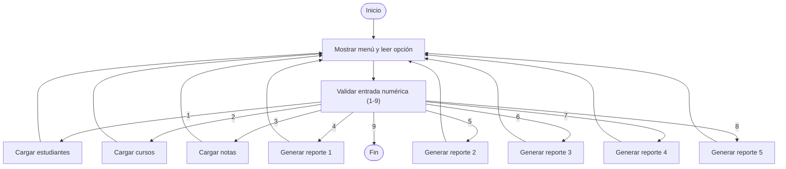
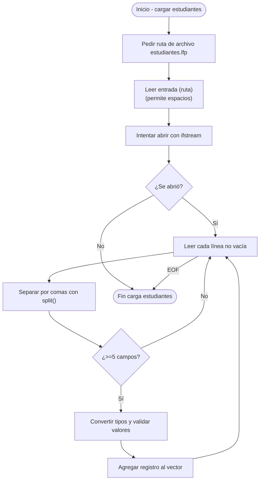
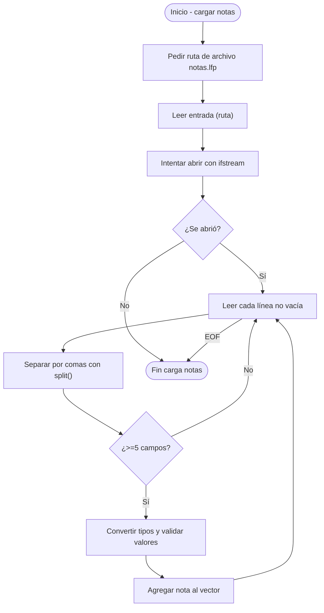
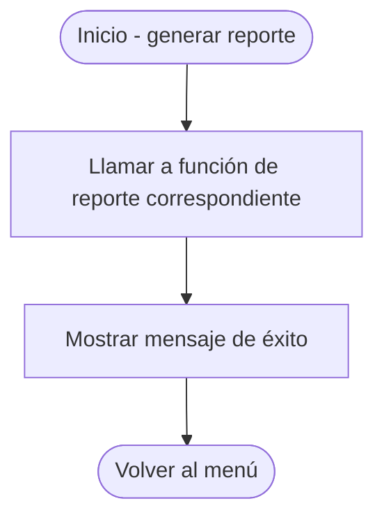

# Diagrama de Flujo del Programa

A continuación se describe el flujo de ejecución general del sistema mediante un
diagrama de flujo. El diagrama usa sintaxis Mermaid, que puede visualizarse en
plataformas que soporten Mermaid (GitHub, VS Code con la extensión apropiada,
etc.).

## Subdiagramas por opción

Cada opción del menú tiene su propio flujo; a continuación se detalla cada uno.

### Opción 1: Cargar archivo de estudiantes

### Opción 2: Cargar archivo de cursos

### Opción 3: Cargar archivo de notas

### Opciones 4–8: Generar reportes

