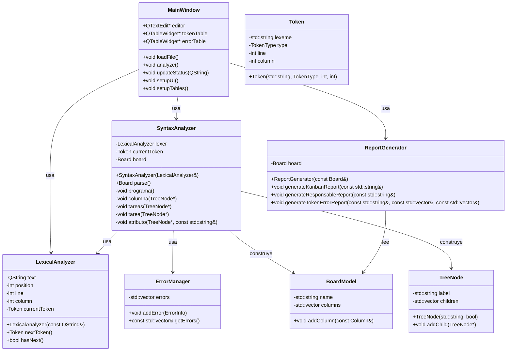
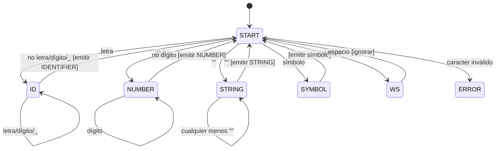

# Manual Técnico

## 1. Introducción

Este documento describe la arquitectura del proyecto `TaskScriptAnalyzer`, un analizador léxico y sintáctico para un lenguaje de definición de tableros Kanban.

Incluye:
- Diagrama de clases UML
- Diagrama del autómata finito determinista (AFD) del analizador léxico
- Gramática libre de contexto del parser
- Descripción del funcionamiento del parser

## 2. Diagrama de clases UML



## 3. Diagrama del AFD del analizador léxico



### Estados principales
- `START`: estado inicial.
- `ID`: lectura de identificadores o palabras reservadas.
- `NUMBER`: lectura de enteros y fechas numéricas.
- `STRING`: lectura de literales entre comillas.
- `SYMBOL`: lectura de delimitadores y operadores.
- `WS`: espacios en blanco y saltos de línea.
- `ERROR`: token inválido.

## 4. Gramática libre de contexto

El parser es un analizador descendente recursivo que reconoce estructuras de tablero y tareas. La gramática se puede describir así:

```
<programa> ::= TABLERO '"' IDENTIFICADOR '"' '{' <columnas> '}'
<columnas> ::= <columna> | <columna> <columnas>
<columna> ::= COLUMNA '"' IDENTIFICADOR '"' '{' <tareas> '}'
<tareas> ::= <tarea> | <tarea> ',' <tareas>
<tarea> ::= TAREA '"' IDENTIFICADOR '"' '[' <atributos> ']'
<atributos> ::= <atributo> | <atributo> ',' <atributos>
<atributo> ::= PRIORIDAD '"' (ALTA|MEDIA|BAJA) '"'
             | RESPONSABLE '"' IDENTIFICADOR '"'
             | FECHA_LIMITE '"' FECHA '"'
             | DESCRIPCION '"' CADENA '"'
```

### Tokens básicos
- `TABLERO`, `COLUMNA`, `TAREA`, `PRIORIDAD`, `RESPONSABLE`, `FECHA_LIMITE`, `DESCRIPCION`
- `IDENTIFICADOR`
- `CADENA`
- `FECHA`
- `COMA`, `LLAVE_ABIERTA`, `LLAVE_CERRADA`, `CORCHETE_ABIERTA`, `CORCHETE_CERRADA`

## 5. Descripción del parser

### Tipo de parser

El parser implementado es un **análisis sintáctico descendente recursivo**. Usa una función por cada regla sintáctica y avanza token a token con `match()` y `nextToken()`.

### Flujo general

1. `SyntaxAnalyzer::parse()` inicia la lectura del programa.
2. Se llama a `programa()`, que espera la palabra reservada `TABLERO`, seguido de un identificador y un bloque de columnas.
3. `columnas()` procesa una o más columnas.
4. Cada `columna()` reconoce el nombre de la columna y llama a `tareas()`.
5. `tareas()` procesa una lista de `tarea()` separadas por comas.
6. `tarea()` construye la tarea y lee sus atributos dentro de corchetes.
7. Cada `atributo()` consume el nombre del atributo y su valor.

### Manejo de errores

- El parser utiliza un `ErrorManager` para registrar errores sintácticos y léxicos.
- Cuando un token no coincide con lo esperado, el parser registra un error y puede intentar recuperar el análisis o finalizar según el caso.

### Estructuras construidas

- El parser construye un objeto `BoardModel` que contiene columnas y tareas.
- También genera un árbol sintáctico compuesto de `TreeNode` para representar la estructura del análisis.
- `ReportGenerator` usa el modelo de tablero resultante para crear reportes HTML.

## 6. Arquitectura General

El sistema sigue una arquitectura modular con separación clara de responsabilidades:

```
[Archivo de entrada] --> [MainWindow] --> [LexicalAnalyzer] --> [SyntaxAnalyzer] --> [BoardModel]
                                      |                       |                      |
                                      v                       v                      v
                                 [ReportGenerator]      [ErrorManager]        [TreeNode]
                                      |
                                      v
                               [Reportes HTML]
```

### 6.1 Componentes Principales
- **MainWindow**: Controla la interfaz gráfica y coordina el análisis.
- **LexicalAnalyzer**: Realiza la tokenización del texto de entrada.
- **SyntaxAnalyzer**: Implementa el parser descendente recursivo.
- **ErrorManager**: Gestiona la colección y reporte de errores.
- **ReportGenerator**: Crea reportes HTML estilizados.
- **BoardModel**: Representa la estructura de datos del tablero Kanban.

## 7. Instalación y Configuración

### 7.1 Requisitos del Sistema
- **SO**: Windows 10/11
- **Compilador**: MinGW-w64 GCC 16.1+
- **Qt6**: Versión 6.5+
- **CMake**: Versión 3.16+

### 7.2 Instalación de Dependencias
```bash
# Instalar Qt6 con MinGW desde qt.io
# Instalar CMake desde cmake.org
# Configurar PATH para mingw64\bin y qt6\bin
```

### 7.3 Compilación
```bash
cd proyecto
mkdir build
cd build
cmake ..
cmake --build . --config Release
```

### 7.4 Ejecución
```bash
./TaskScriptAnalyzer.exe
```

## 8. Uso del Programa

### 8.1 Interfaz Gráfica
1. **Cargar archivo**: Botón "Cargar" → seleccionar .task
2. **Editar**: Modificar texto en el editor central
3. **Analizar**: Botón "Analizar" → procesa y muestra resultados
4. **Ver reportes**: Archivos HTML generados en el directorio raíz

### 8.2 Formato de Archivo de Entrada
```
TABLERO "Proyecto Alpha" {
    COLUMNA "POR HACER" {
        TAREA "Diseñar UI" [
            PRIORIDAD "ALTA",
            RESPONSABLE "Juan",
            FECHA_LIMITE "20231231",
            DESCRIPCION "Crear mockups de la interfaz"
        ]
    }
}
```

## 9. Ejemplos de Uso

### 9.1 Archivo de Entrada Válido
```
TABLERO "Kanban Ejemplo" {
    COLUMNA "POR HACER" {
        TAREA "Tarea 1" [PRIORIDAD "ALTA", RESPONSABLE "Ana"]
    }
    COLUMNA "EN PROGRESO" {
        TAREA "Tarea 2" [PRIORIDAD "MEDIA", RESPONSABLE "Carlos", FECHA_LIMITE "20231225"]
    }
}
```

### 9.2 Salida del Reporte Kanban
- Genera `reporte_kanban.html` con grid de columnas
- Cada tarea muestra prioridad con color (rojo/amarillo/verde)
- Información de responsable y fecha límite

## 10. Manejo de Errores

### 10.1 Tipos de Error
- **Léxico**: Caracteres inválidos, strings sin cerrar
- **Sintáctico**: Tokens inesperados, estructuras incompletas
- **Semántico**: Valores inválidos (prioridad no reconocida)

### 10.2 Registro de Errores
```cpp
void ErrorManager::addError(ErrorInfo error) {
    errors.push_back(error);
}
```

### 10.3 Visualización
- Tabla de errores en la GUI
- Reporte HTML con errores destacados
- Mensajes de estado en la barra inferior

## 11. Dependencias Externas

### 11.1 Qt6
- **QtCore**: QString, QVector, etc.
- **QtWidgets**: QMainWindow, QTableWidget, QTextEdit
- **QtGui**: QApplication

### 11.2 STL
- `<vector>`, `<string>`, `<map>` para estructuras de datos
- `<fstream>` para I/O de archivos

## 12. Limitaciones y Mejoras Futuras

### 12.1 Limitaciones Actuales
- No soporta comentarios en el código fuente
- Fechas limitadas a formato YYYYMMDD
- No hay validación semántica avanzada
- Interfaz limitada a Windows

### 12.2 Mejoras Planificadas
- Soporte para expresiones regulares en validaciones
- Generación de código (ej. SQL, JSON)
- Modo consola puro sin GUI
- Soporte multi-plataforma (Linux, macOS)

## 13. Detalle de Clases y Métodos

### 13.1 `MainWindow`
- `QTextEdit* editor`: Área donde se escribe o se carga el script.
- `QTableWidget* tokenTable`: Tabla que muestra los tokens generados.
- `QTableWidget* errorTable`: Tabla que muestra errores de análisis.
- `void loadFile()`: Carga un archivo de texto en el editor.
- `void analyze()`: Inicia el análisis léxico y sintáctico.
- `void updateStatus(QString)`: Actualiza la barra de estado.
- `void setupUI()`: Construye la interfaz gráfica.
- `void setupTables()`: Configura las tablas de tokens y errores.

### 13.2 `LexicalAnalyzer`
- `QString text`: Texto completo a tokenizar.
- `int position`: Posición actual en el texto.
- `int line`, `int column`: Ubicación del token actual para mensajes de error.
- `Token nextToken()`: Devuelve el siguiente token válido.
- `bool hasNext()`: Indica si hay más caracteres por tokenizar.

Responsabilidad: separar la entrada en lexemas y clasificar cada token según su tipo.

### 13.3 `SyntaxAnalyzer`
- `LexicalAnalyzer lexer`: Motor de tokens.
- `Token currentToken`: Token actualmente analizado.
- `Board board`: Modelo del tablero que se construye.
- `Board parse()`: Método principal que devuelve el modelo final.
- `void programa()`: Analiza la regla principal del programa.
- `void columna(TreeNode*)`: Analiza una columna del tablero.
- `void tareas(TreeNode*)`: Analiza una lista de tareas.
- `void tarea(TreeNode*)`: Analiza una tarea individual.
- `void atributo(TreeNode*, const std::string&)`: Analiza un atributo de tarea.

Responsabilidad: verificar la sintaxis y construir el modelo estructurado.

### 13.4 `ErrorManager`
- `std::vector<ErrorInfo> errors`: Lista de errores registrados.
- `void addError(ErrorInfo)`: Añade un error al registro.
- `const std::vector<ErrorInfo>& getErrors()`: Devuelve la lista de errores.

Responsabilidad: almacenar y exponer errores para la GUI y los reportes.

### 13.5 `ReportGenerator`
- `Board board`: Modelo de tablero para generar reportes.
- `void generateKanbanReport(const std::string&)`: Genera un reporte visual del Kanban.
- `void generateResponsableReport(const std::string&)`: Genera un reporte de responsables.
- `void generateTokenErrorReport(const std::string&, const std::vector<Token>&, const std::vector<ErrorInfo>&)`: Genera informe de tokens y errores.

Responsabilidad: transformar el modelo en HTML y estilos listos para presentación.

### 13.6 `BoardModel` y estructuras de datos
- `BoardModel`: Representa el tablero completo.
- `Column`: Representa una columna del tablero.
- `Task`: Representa una tarea dentro de una columna.
- `Token`: Contiene lexema, tipo, línea y columna.
- `TreeNode`: Nodo para representar una estructura jerárquica del análisis.

Responsabilidad: almacenar la representación en memoria del tablero procesado.

## 14. Especificación de Tokens y Símbolos

### 14.1 Palabras reservadas
- `TABLERO`
- `COLUMNA`
- `TAREA`
- `PRIORIDAD`
- `RESPONSABLE`
- `FECHA_LIMITE`
- `DESCRIPCION`

### 14.2 Literales
- `IDENTIFICADOR`: Texto entre comillas para nombres de tablero, columnas y tareas.
- `CADENA`: Texto libre entre comillas para descripciones.
- `FECHA`: Secuencia de 8 dígitos en formato `YYYYMMDD`.

### 14.3 Delimitadores y separadores
- `LLAVE_ABIERTA` `{`
- `LLAVE_CERRADA` `}`
- `CORCHETE_ABIERTA` `[` 
- `CORCHETE_CERRADA` `]`
- `COMA` `,`

### 14.4 Reglas léxicas resumidas
- Identificadores y palabras reservadas inician con letra.
- Fechas son cadenas numéricas de longitud exacta 8.
- Cadenas literales están entre comillas dobles.
- Espacios y saltos de línea se ignoran.
- Caracteres no reconocidos generan un token de error.

## 15. Pseudocódigo del Parser

```cpp
void SyntaxAnalyzer::parse() {
    currentToken = lexer.nextToken();
    programa();
    if (currentToken.type != TokenType::FIN) {
        errorManager.addError({"Token inesperado al final", currentToken.line, currentToken.column});
    }
}

void SyntaxAnalyzer::programa() {
    match(TokenType::TABLERO);
    match(TokenType::CADENA); // nombre del tablero
    match(TokenType::LLAVE_ABIERTA);
    columnas();
    match(TokenType::LLAVE_CERRADA);
}

void SyntaxAnalyzer::columnas() {
    while (currentToken.type == TokenType::COLUMNA) {
        columna(rootNode);
    }
}

void SyntaxAnalyzer::columna(TreeNode* parent) {
    match(TokenType::COLUMNA);
    match(TokenType::CADENA);
    match(TokenType::LLAVE_ABIERTA);
    tareas(parent);
    match(TokenType::LLAVE_CERRADA);
}

void SyntaxAnalyzer::tareas(TreeNode* parent) {
    tarea(parent);
    while (currentToken.type == TokenType::COMA) {
        match(TokenType::COMA);
        tarea(parent);
    }
}

void SyntaxAnalyzer::tarea(TreeNode* parent) {
    match(TokenType::TAREA);
    match(TokenType::CADENA);
    match(TokenType::CORCHETE_ABIERTA);
    atributos(parent);
    match(TokenType::CORCHETE_CERRADA);
}
```

## 16. Ejemplos, Casos de Prueba y Resultados Esperados

### 16.1 Entradas válidas
- Tablero con una columna y una tarea.
- Tablero con múltiples columnas y tareas.
- Atributos `PRIORIDAD`, `RESPONSABLE`, `FECHA_LIMITE` y `DESCRIPCION` en distintas combinaciones.

### 16.2 Entradas inválidas y comportamiento esperado

#### Caso 1: Faltan llaves
```
TABLERO "Proyecto" {
    COLUMNA "Por Hacer" {
        TAREA "Tarea 1" [PRIORIDAD "ALTA"]
```
- Error esperado: `Falta '}'` o `Token inesperado`.

#### Caso 2: Coma faltante entre tareas
```
COLUMNA "En Progreso" {
    TAREA "Tarea A" [PRIORIDAD "MEDIA"]
    TAREA "Tarea B" [PRIORIDAD "BAJA"]
}
```
- Error esperado: `Se esperaba ',' entre tareas`.

#### Caso 3: Atributo desconocido
```
TAREA "Prueba" [COLOR "ROJO"]
```
- Error esperado: `Atributo no válido`.

#### Caso 4: Cadena sin cerrar
```
TABLERO "Proyecto {
```
- Error esperado: `Literales sin cerrar`.

### 16.3 Ejecuciones de prueba recomendadas
- Ejecutar con archivo válido para validar la generación de reporte Kanban.
- Ejecutar con archivo con errores sintácticos para comprobar la tabla de errores.
- Comparar salida esperada con reportes HTML generados.

## 17. Estrategia de Recuperación de Errores

### 17.1 Registro y notificación
- Se genera un error al encontrar un token inesperado.
- El mensaje incluye línea y columna.
- El parser no detiene el programa completo hasta validar el final si es posible.

### 17.2 Recuperación básica
- Si falta un delimitador, el parser trata de sincronizar al siguiente token válido.
- En caso de token desconocido, se omite el lexema y se continúa.
- El análisis finaliza cuando no es posible continuar de manera segura.

### 17.3 Ejemplo de mensaje
- `Error: token inesperado '}' en línea 10, columna 5`
- `Error: se esperaba ']' después de los atributos de la tarea`
- `Error: prioridad no reconocida en TAREA "X"`

## 18. Guía de Compilación y Despliegue

### 18.1 Windows con MinGW y Qt6
```powershell
cd "c:\Users\jimhu\Desktop\1S2026_-LFPA-_-202303768\PROYECTO 2"
mkdir build
cd build
cmake .. -G "MinGW Makefiles"
cmake --build . --config Release
```

### 18.2 Linux (Qt6 + CMake)
```bash
cd /ruta/al/proyecto
mkdir -p build
cd build
cmake ..
make
```

### 18.3 Ejecución después de compilar
```bash
./TaskScriptAnalyzer.exe
```

### 18.4 Notas de despliegue
- Asegurar que `qt6core.dll`, `qt6widgets.dll` y demás bibliotecas de Qt estén en el `PATH` o en el mismo directorio del ejecutable.
- Si se usa Qt Creator, configurar el kit de compilación con Qt6 y MinGW.

## 19. Uso en Consola (Modo Propuesto)

### 19.1 Estado actual
- El proyecto actual está orientado a GUI.
- No existe un modo de línea de comandos totalmente implementado en esta versión.

### 19.2 Idea de comando
```bash
TaskScriptAnalyzer.exe --input archivo.task --output reporte.html
```

### 19.3 Beneficios de un modo consola
- Automatización por lotes.
- Integración en scripts y pipelines.
- Ejecución sin entorno gráfico.

## 20. Estructura del Proyecto

### 20.1 Carpetas principales
- `build/`: Archivos de compilación y binarios.
- `resources/`: Recursos de la aplicación.
- `src/`: Código fuente C++.
- `Documentación/`: Manuales e información de diseño.

### 20.2 Archivos fuente
- `src/MainWindow.cpp` / `src/MainWindow.h`: Interfaz y lógica de usuario.
- `src/LexicalAnalyzer.cpp` / `src/LexicalAnalyzer.h`: Tokenización.
- `src/SyntaxAnalyzer.cpp` / `src/SyntaxAnalyzer.h`: Parser sintáctico.
- `src/ErrorManager.cpp` / `src/ErrorManager.h`: Manejo de errores.
- `src/ReportGenerator.cpp` / `src/ReportGenerator.h`: Generación de reportes HTML.
- `src/BoardModel.cpp` / `src/BoardModel.h`: Modelo del tablero.
- `src/Token.cpp` / `src/Token.h`: Definición de tokens.
- `src/TokenType.h`: Enumeración de tipos de token.
- `src/TreeNode.cpp` / `src/TreeNode.h`: Estructura de árbol sintáctico.
- `src/main.cpp`: Punto de entrada de la aplicación.

## 21. `.gitignore` recomendado

```
# Build
/build/
/CMakeFiles/
/CMakeCache.txt
/*.cmake
/*.o
/*.obj
/*.exe
/*.dll
/*.so
/*.pdb
/*.ilk

# Qt Creator
*.pro.user*
*.user
*.user.*
*.qbs.user

# Visual Studio
.vs/
*.vcxproj.user

# Documentación generada
*.html

# Otros
*.log
*.tmp
*~
```

## 22. Glosario

- **Token**: unidad mínima de significado reconocida por el analizador léxico.
- **Lexema**: texto original asociado a un token.
- **Parser**: componente que verifica la estructura gramatical de la entrada.
- **AST**: Árvore de sintaxis abstracta, representación jerárquica de la estructura del programa.
- **AFD**: Autómata Finito Determinista, modelo para tokenización.
- **Gramática**: Conjunto de reglas que describe la sintaxis válida.
- **Semántica**: Significado de la estructura una vez analizada.

## 23. Anexos

- Tablas de tokens y símbolos.
- Ejemplos de scripts de prueba.
- Capturas de pantalla de la interfaz y los reportes generados.

---

Este Manual Técnico proporciona una guía completa para el desarrollo, mantenimiento y extensión del TaskScriptAnalyzer.
